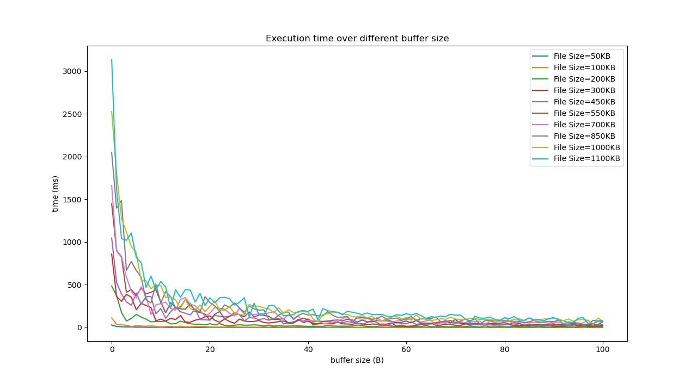
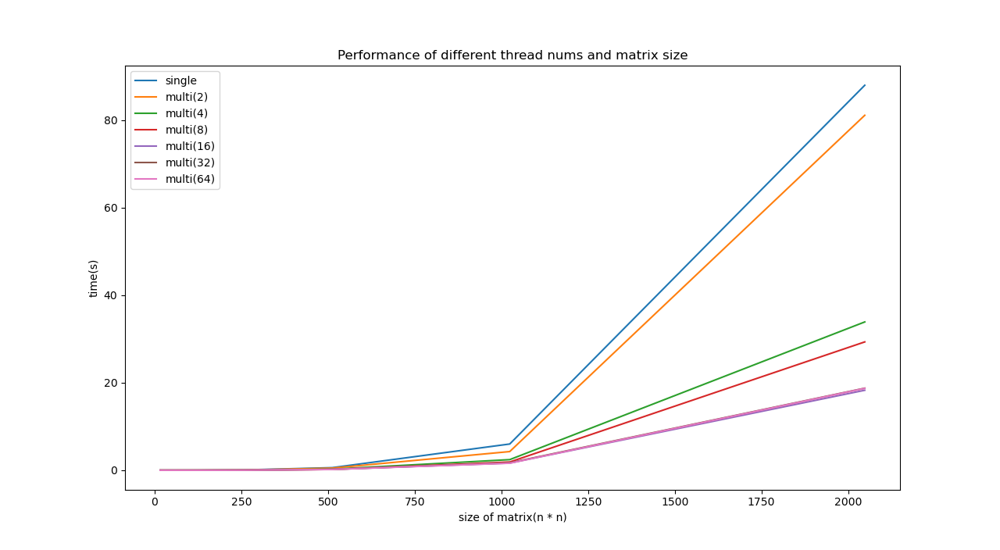

# Prj1README

#### Project Structure

```shell
proj1
├── copy
│   ├── Copy.c
│   ├── data
│   │   ├── 10.txt
│   │   ├── 1.txt
│   │   ├── 2.txt
│   │   ├── 3.txt
│   │   ├── 4.txt
│   │   ├── 5.txt
│   │   ├── 6.txt
│   │   ├── 7.txt
│   │   ├── 8.txt
│   │   └── 9.txt
│   ├── header.h
│   ├── Makefile
│   ├── pic
│   │   └── Figure_1.png
│   └── typescript.txt
├── matrix
│   ├── data
│   │   ├── 1024.in
│   │   ├── 128.in
│   │   ├── 16.in
│   │   ├── 2048.in
│   │   ├── 256.in
│   │   ├── 32.in
│   │   ├── 512.in
│   │   └── 64.in
│   ├── header.h
│   ├── Makefile
│   ├── multi.c
│   ├── pic
│   │   └── Figure_1.png
│   ├── sample
│   │   ├── sample_data.in
│   │   ├── sample_data.out
│   │   └── sample_random.out
│   ├── single.c
│   └── typescript.txt
├── OS_proj1.pdf
├── Prj1README.md
└── shell
    ├── header.h
    ├── Makefile
    ├── shell.c
    └── typescript.txt
```


#### Copy

- Source file name: Copy.c
- Executable file name: Copy
- Command line: ./Copy <InputFile> <OutputFile> <BufferSize>
- Test data: ./data
- Diagram of performance: ./pic

Usage:

```shell
./Copy <InputFile> <OutputFile> <BufferSize>
```

Diagram of the execution time over different buffer size:




#### Shell

- Command line for telnet: telnet <IPAddress> <Port>

- Source file name: shell.c

- Executable file name: shell

- Command line: ./shell <Port>

Usage:

```shell
./shell <Port> 
telnet <IPAddress> <Port>
```


#### Matrix

- Source file name: single.c, multi.c

- Executable file name: single, multi

- Test data: ./data

- Command line: 

  ./single or ./single <InputFile> <OutputFile> 

  ./multi or ./multi <InputFile> <OutputFile> or ./multi <Size>

Usage:

```shell
./single <InputFile> <OutputFile> 
./multi <InputFile> <OutputFile>
./multi <Size>
```


Diagram of the execution time over different size of matrix:

